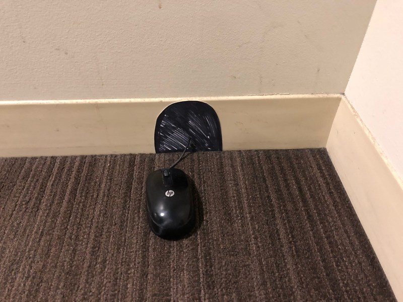

# Object Detection Server

## Overview

This repository was created during my time at **CSU Stanislaus** to
support object detection in an environment outside the default system
package (**ROS2**). It provides a lightweight server for performing
object detection on images, along with a small set of test images.

The implementation is intentionally minimal and is meant to serve as an
**entry point for future experimentation** rather than a full production
system.

The server uses a Zod-based socket interface and includes several
configuration options defined as constants in `index.py`.

### Default Detection Classes

The server is initialized with the following preset classes:

-   backpack\
-   mouse\
-   computer mouse\
-   vulture\
-   triceratops

## How It Works

1.  Images are encoded using **OpenCV (cv2)** and sent to the inference
    server.
2.  The server uses **EfficientNet (via Keras)** to classify objects in
    the image.
3.  By default, the model generates the **top 1000 predictions**.
4.  These predictions are filtered using the `detection_labels`
    parameter provided when the server starts.

## Examples

### Test Image 1


**Response:**
```{
  "detection_labels": [
    "backpack",
    "mouse",
    "vulture",
    "triceratops"
  ],
  "top_k": 1000,
  "total_results": 1000,
  "filtered_results": 4,
  "top_label": "backpack",
  "top_score": 0.08420001,
  "results": [
    {
      "imagenet_id": "n02769748",
      "label": "backpack",
      "score": 0.08420001
    },
    {
      "imagenet_id": "n01616318",
      "label": "vulture",
      "score": 0.00012333103
    },
    {
      "imagenet_id": "n01704323",
      "label": "triceratops",
      "score": 9.358831e-05
    },
    {
      "imagenet_id": "n03793489",
      "label": "mouse",
      "score": 5.514009e-05
    }
  ]
}
```

### Test Image 2



**Response:**
```
{
  "detection_labels": [
    "backpack",
    "mouse",
    "vulture",
    "triceratops"
  ],
  "top_k": 1000,
  "total_results": 1000,
  "filtered_results": 4,
  "top_label": "mouse",
  "top_score": 0.08211868,
  "results": [
    {
      "imagenet_id": "n03793489",
      "label": "mouse",
      "score": 0.08211868
    },
    {
      "imagenet_id": "n01616318",
      "label": "vulture",
      "score": 0.0003205848
    },
    {
      "imagenet_id": "n01704323",
      "label": "triceratops",
      "score": 5.0523384e-05
    },
    {
      "imagenet_id": "n02769748",
      "label": "backpack",
      "score": 2.8250191e-05
    }
  ]
}
```

## Installation & Usage

### Virtual Environment

``` bash
# Create a virtual environment
python -m venv .venv

# Activate the virtual environment in your preferred terminal
# Use separate terminals for the server and client
```

### Install Dependencies

``` bash
pip install -r requirements.txt

# -or-

pip install -r requirements_frozen.txt
```

### Terminal 1 --- Start the Server

``` bash
python socket-test-server-runner.py
```

### Terminal 2 --- Run the Client

``` bash
python socket-test-client-runner.py
```

## Author

**Steven R. Berdak**\
📧 stevenberdak@gmail.com
